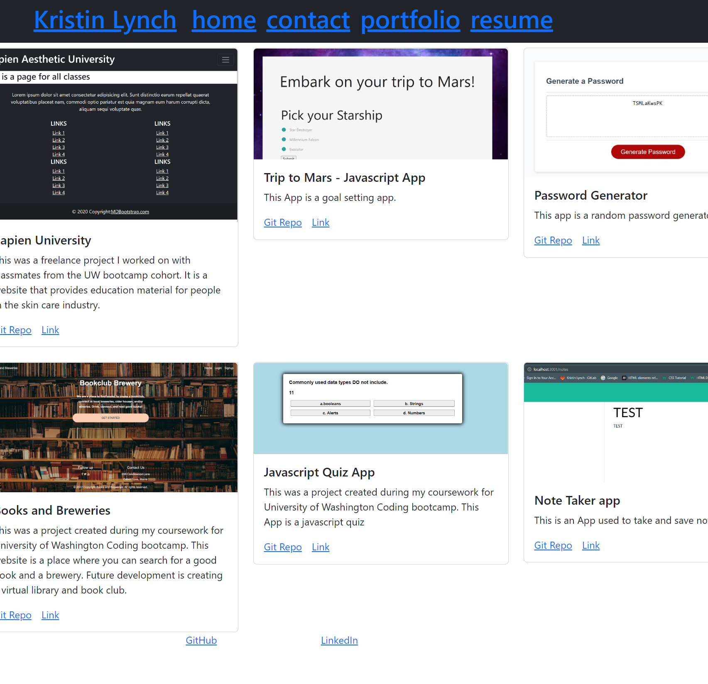

  # KL Portfolio   [](https://opensource.org/licenses/MIT)

  ## Project Description 

  This is my personal portfolio that I created using React. This is a single page application with responsive elements. Feel Free to click through and contact me if you have any questions! 
  
  Live Deployment cand be viewed at:
  
   https://lynchk07.github.io/KL_portfolio/

   Github repo:

    https://github.com/Lynchk07/KL_portfolio

  # Table of Contents

  - [Installation](#installation)

  - [Usage](#usage)

  - [License](#license)

  - [Contributing](#contributing)

  - [Tests](#tests)

  - [Questions](#questions)

  - [Screenshot](#screenshot)

    
  ## Installation 

  Node.js a javascript runtime which is required to run this project. Download Node.js at https://nodejs.org/dist/v16.17.0/node-v16.17.0-x64.msi. 

  ```
  npm install
  ```

  ## Usage 

  To run this application, open a terminal in the same folder as the project.

  To run a dev version of the app for testing, run the following command:

  ```
  npm run start
  ```

  to build the application and deploy it after linking it with a github pages site, run the following command

  ```
  npm run deploy
  ```

  ## License 

  MIT License

  ### About this License 

  Copyright 2022, Kristin Lynch

  Permission is hereby granted, free of charge, to any person obtaining a copy of this software and associated documentation files (the "Software"), to deal in the Software without restriction, including without limitation the rights to use, copy, modify, merge, publish, distribute, sublicense, and/or sell copies of the Software, and to permit persons to whom the Software is furnished to do so, subject to the following conditions:

  The above copyright notice and this permission notice shall be included in all copies or substantial portions of the Software.

  THE SOFTWARE IS PROVIDED "AS IS", WITHOUT WARRANTY OF ANY KIND, EXPRESS OR IMPLIED, INCLUDING BUT NOT LIMITED TO THE WARRANTIES OF MERCHANTABILITY, FITNESS FOR A PARTICULAR PURPOSE AND NONINFRINGEMENT. IN NO EVENT SHALL THE AUTHORS OR COPYRIGHT HOLDERS BE LIABLE FOR ANY CLAIM, DAMAGES OR OTHER LIABILITY, WHETHER IN AN ACTION OF CONTRACT, TORT OR OTHERWISE, ARISING FROM, OUT OF OR IN CONNECTION WITH THE SOFTWARE OR THE USE OR OTHER DEALINGS IN THE SOFTWARE.

  [Link to the MIT Webpage](https://www.mit.edu/~amini/LICENSE.md)

  ## Contributing 

  Kristin Lynch

  ## Tests 

  Tests have not been implemented for this version

  ## Questions 

  For questions contact me via github at: 

## Future Development 

    Bootstrap and CSS additional styling

  ## Screenshot
  
   Below is a screenshot of the portfolio: https://github.com/Lynchk07
   
![screenshot] 
